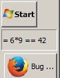

Processes
=========

Unlike on unix, Popen on windows does not scan PATH but the functions in
`ht3.utils.windows.process` do. With the default scripts loaded, you can
`execute("tool")` and the execute function will look through PATH, and
will also try different extensions (`.exe`, `.bat`, ...) from PATHEXT

Locating Tools can be weird!
---------------------------

When a 32bit application (python) accesses `C:\Windows\System32` that is retargeted to
`C:\Windows\SysWOW64` because SysWOW64 contains all 32bit libs and System32 contains 64 bit
binaries and executables (No i did not confuse that, 64bit stuff is in System32 and 32bit stuff is
in SysWOW64). Now you might want to execute tools like `SnippingTool` or `msconfig` which lie in
(the real) System32 and thanks to windows thinking for you (?) your Sytem32 path gets translated
to SysWOW64 where the tool won't be found. To work around exactly this problem, there is another
virtual folder or replacement rule or whatever (You won't see it in the explorer but that doesn't
say much), so that `C:\Windows\Sysnative` can be used to actually access System32.

**TL;DR**
To be able to execute tools like `msconfig`, The `Sysnative` directory is added to your PATH
by the default windows script

    PATH.append(Path(r"C:\Windows\Sysnative"))

Win32 API
========

Some functions to work with windows on Windows are already imported
from `ht3.util.windows`, for example you can do

    SetForegroundWindow(FindWindow(cls='PuTTY'))

More functions can be defined the same way as in `ht3.util.windows.hwnds`.
Please submit a pull request on github if you have useful functions.

GUI Tipps
==========

You can add a box to your task bar that is named `hanstool` by creating a
folder somewhere. Then, by right clicking on the taskbar, selecting `Add
Toolbar`, `New Toolbar` and choosing the `hanstool` folder, you get a new
toolbar with the name `hanstool`.  The `GetTaskBarHandle` function looks for this toolbar.  The
`windows.10.py` file defines a `PlaceOverTaskbar` command that places the command
window positionally over that toolbar. By calling `cmd_win_stay_on_top()`, the
command window even stays on top of the TaskBar most of the time.

The DockInTaskbar command goes further and puts the command window inside the
toolbar window using `SetParent`. This looks and feels like a `DeskBand` which
are horribly difficult (activeX, Com, ...) to get working. However, if your HT
hangs, the Taskbar hangs as well. This does not happen often. Killing the
relevant python instance helps. You have been warned.

This is how it looks with a vertical Taskbar

